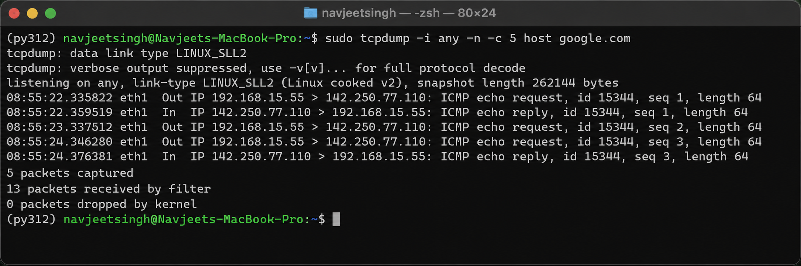

# Network Troubleshooting & Verification Commands

### 1. Host Information and Network Interfaces

* `hostname`

  * Displays the name assigned to the system, which identifies the computer on the network.

* `ifconfig`

  * A traditional networking command used to view network interface configuration, IP addresses, and transmission statistics.

---

### 2. Socket and Port Information

* `netstat -tuln`

  * A commonly used legacy command for viewing listening TCP/UDP ports and their associated network information.

---

### 3. ARP Cache

* `arp -a`

  * Shows the ARP table, which contains mappings between local IP addresses and the corresponding MAC addresses of devices on the network.

### 4. DNS Resolution

* `nslookup google.com`

  * Sends a DNS query to find the IP address associated with `google.com`, helping verify that DNS resolution is working correctly.

* `dig google.com`

  * Provides detailed DNS query and response information, making it useful for deeper DNS troubleshooting and analysis.

---

### 5. Connectivity and Network Path Testing

* `ping -c 4 google.com`

  * Sends four ICMP packets to Google to check whether the destination is reachable and measure the response time.

* `traceroute google.com`

  * Displays the sequence of network hops between the local system and Google, helping identify where delays or connectivity problems may occur.

---

### 6. TCP Port Connectivity

* `timeout 3 telnet google.com 80`

  * Attempts to establish a connection to Google's HTTP port (80) and automatically terminates the test after 3 seconds.

---

### 7. HTTP/HTTPS Connectivity Verification

* `curl -I https://www.google.com`

  * Retrieves only the HTTP response headers from Google over HTTPS, allowing you to verify whether the web server is responding successfully.

---

### 9. Network Packet Capture

* `sudo tcpdump -i any -n -c 5 host google.com`

  * Captures five network packets related to communication with Google across all available network interfaces, providing a quick look at network traffic.

### 10. Routing Information

* `ip route`

  * A modern command for viewing the routing table and determining how the system forwards network traffic through gateways and interfaces.

---
